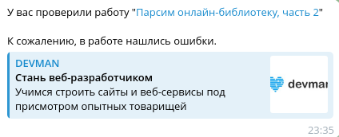

# Devman Bot
Бот, который следит за проверкой заданий на Devman и отправляет уведомления в Telegram.


## 📦 Установка
Проект был реализован в Python 3.13, работа в других версиях не гарантирована.

Склонировать репозиторий и перейти в папку проекта:
```bash
git clone https://github.com/K-Mickey/devman-bot.git
cd devman-bot
```

### Установить зависимости:
Для UV:
```bash
uv venv
source .venv/bin/activate  # Linux/MacOS
# source .\.venv\Scripts\activate  # Windows
uv pip sync pyproject.toml uv.lock
```

Без UV:
```bash
python -m venv .venv
source .venv/bin/activate  # Linux/MacOS
# source .\.venv\Scripts\activate  # Windows
pip install -r requirements.txt
```

### Создать файл .env
Создайте файл .env в директории проекта и заполните его обязательными данными:
- **DEVMAN_TOKEN** - токен пользователя Devman. Получить в [профиле Devman](https://dvmn.org/api/docs/)
- **BOT_TOKEN** - токен бота Telegram. Создать через [@BotFather](https://t.me/BotFather)
- **ADMIN_ID** - айди администратора в Telegram. Узнать в [боте](https://t.me/userinfobot)

Опциональные настройки:
- **LOG_LEVEL** - уровень логирования. По умолчанию INFO
- **LOG_FORMAT** - формат логирования

## 🚀 Использование
Запустите бота и отправьте ему команду _/start_.

## 📄 Цели проекта
Код написан в учебных целях — это урок в курсе по Python и веб-разработке на сайте [Devman](https://dvmn.org/).